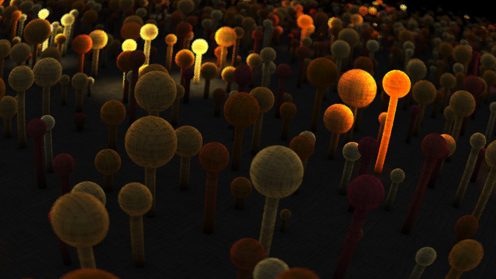
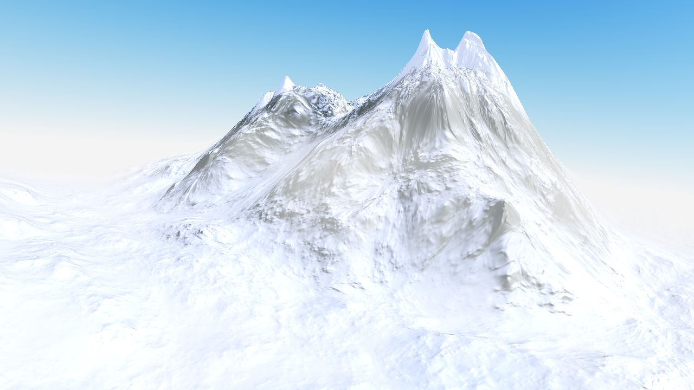
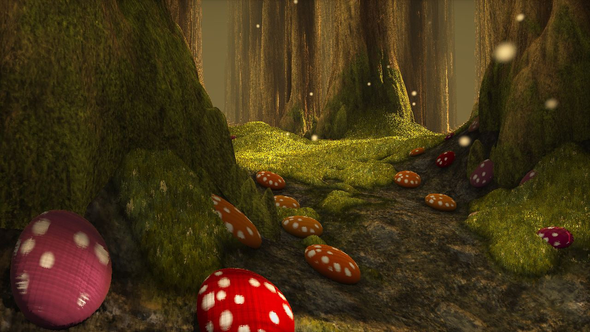

# Shadertoy GLSL previewer
This is a GLSL fragment shader previewer, specifically designed to be compatible
with fragment shaders written for ShaderToy (http://www.shadertoy.com).

Copyright (C) 2013 John Tsiombikas <nuclear@member.fsf.org>
This program is free software. Feel free to use it, modify it, redistribute it
(with or without modifications), under the terms of the GNU General Public
License version 3 or, at your option, any later version published by the Free
Software Foundation. See COPYING for details.

## Gallery
| | |
|:-------------------------:|:-------------------------:|
|  Clouds |  Lanterns |
|  Mountain Peak |  Woods |
| | | |

## Usage instructions
The idea is that at some point you will be able to write a configuration file
(see example-shadertoy.conf) to specify paths containing shadertoy fragment
shaders. Then this program would show you a gallery of thumbnails or something
equivalent, and let you pick any one to view fullscreen.

At the moment however the usage is pretty rudimentary. You'll have to specify
the shader to load from the command line, as well as the ID of the texture you
wish to use in each one of the four sampler slots. The IDs are printed when the
program starts and loads textures during init, so run it once to see which is
which.

Example:
./shadertoy myshader.glsl -t 0 -t 12 -t 3

## Changes
- CMake project & build support
- added data folder for textures and example glsl shaders
- added dependencies as static libraries (freeglut, glew, imago2, libjpeg, libpng, zlib)

## Configure, build and run
```
git clone https://github.com/Woking-34/shadertoy-view.git
cd shadertoy-view
mkdir shadertoy-build && cd shadertoy-build
cmake .. -G"Visual Studio 15 2017 Win64"
cmake --build . --target shadertoy --config Release

cd ../shadertoy-bin/Release
shadertoy.exe ../../data/Lanterns.glsl -t 8 -t 11
shadertoy.exe ../../data/Woods.glsl -t 13 -t 6 -t 9 -t 7
shadertoy.exe ../../data/Clouds.glsl -t 13
shadertoy.exe ../../data/MountainPeak.glsl
```

## References
 - [iq - Clouds](https://www.shadertoy.com/view/4sB3D1)
 - [iq - Lanterns](https://www.shadertoy.com/view/4sB3D1)
 - [iq - Woods](https://www.shadertoy.com/view/4sB3D1)
 - [tdm - Mountain Peak](https://www.shadertoy.com/view/llK3WR)
 - [trusktr gist - image-grid.md](https://gist.github.com/trusktr/93175b620d47827ffdedbf52433e3b37)
